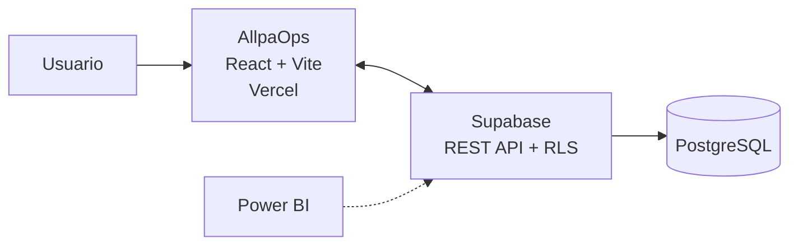
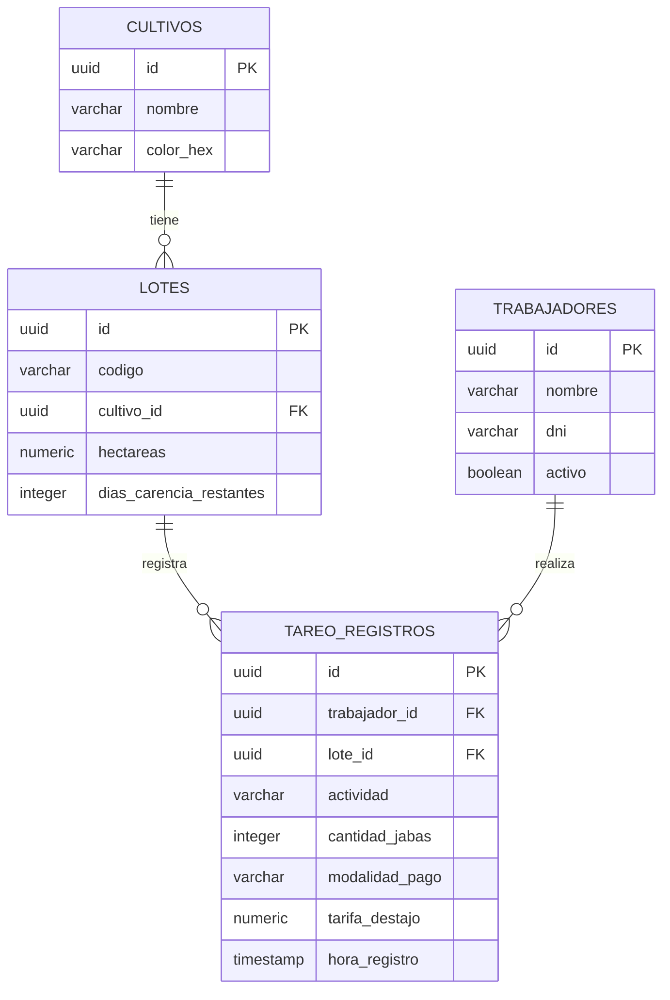

# 🌱 AllpaOps

**ERP SaaS para gestión agrícola — Trazabilidad, tareo digital y cumplimiento normativo para el agroexportador peruano.**

> Trabajo final del curso de Sistemas de Información Gerencial — Universidad Nacional Agraria La Molina (UNALM)

---

## 📋 Tabla de Contenidos

- [El Problema](#-el-problema)
- [La Solución](#-la-solución)
- [Funcionalidades Principales](#-funcionalidades-principales)
- [Stack Tecnológico](#-stack-tecnológico)
- [Arquitectura](#-arquitectura)
- [Modelo de Datos](#-modelo-de-datos)
- [Instalación y Uso Local](#-instalación-y-uso-local)
- [Variables de Entorno](#-variables-de-entorno)
- [Estructura del Proyecto](#-estructura-del-proyecto)
- [Planes y Pricing](#-planes-y-pricing)
- [Roadmap](#-roadmap)
- [Autor](#-autor)

---

## 🎯 El Problema

En el campo agrícola peruano, el **tareo** (registro diario de labores y producción de los trabajadores) se sigue haciendo predominantemente en papel, Excel o WhatsApp. Esto genera lo que llamamos la **"trampa de la manualidad"**:

- **Latencia crítica**: 24-48 horas de retraso entre lo que ocurre en campo y lo que ve gerencia.
- **Errores de transcripción**: la información pasa por varias manos antes de llegar a un sistema digital.
- **Fraude y sobrecostos**: suplantación de identidad y "horas fantasma" en planillas, cuando la mano de obra ya representa cerca del 60% del OpEx de una operación agrícola.
- **Riesgo de exportación**: si un trabajador cosecha un lote que aún está en período de carencia (tiempo de espera tras aplicar un pesticida), el contenedor completo puede ser rechazado en puerto por residuos químicos fuera de norma — un riesgo comercial directo bajo normas como **GlobalG.A.P.**

Los ERPs tradicionales (SAP y similares) resuelven parte de esto, pero sus licencias son inaccesibles para medianos y pequeños productores — dejando un vacío entre "papel" y "ERP corporativo".

## 💡 La Solución

**AllpaOps** es un ERP SaaS de complejidad intermedia: más estructurado que una hoja de Excel, más accesible que un SAP. Digitaliza el tareo de campo en tiempo real, conecta automáticamente esos registros con el estado de sanidad/carencia de cada lote, y genera reportes de trazabilidad listos para auditoría — todo desde una arquitectura ligera (Backend-as-a-Service) que mantiene los costos operativos bajos.

## ⚙️ Funcionalidades Principales

| Módulo | Descripción |
|---|---|
| **Dashboard Operativo** | KPIs en tiempo real (jabas cosechadas, trabajadores activos, lotes en carencia) con filtro Día/Semana, y 4 gráficos de productividad por trabajador, cultivo, lote y evolución temporal. |
| **Tareo de Campo** | Formulario de registro digital por DNI del trabajador, con **bloqueo automático** si se intenta registrar cosecha en un lote en período de carencia activa, y cálculo en vivo de pago a destajo. |
| **Sanidad y Carencia** | Monitoreo del estado fitosanitario de cada lote (En Carencia Activa / Listo para Cosecha / Cosechado Seguro), derivado automáticamente de los registros reales de Tareo. |
| **Mapa de Lotes** | Vista espacial simplificada del estado operativo de los 10 lotes del fundo. |
| **Trazabilidad / Audit-Ready** | Generación de certificados de cumplimiento (GlobalG.A.P.) con descarga real en PDF, mostrando el estado de inocuidad consolidado por lote. |
| **Integraciones** | Conectores a bases de datos (Supabase, PostgreSQL, Redis), automatización (n8n, Zapier, Slack) y ERPs externos (SAP, Nisira, SpaceAG, entre otros) — incluyendo un **modal de conexión real y verificable** a Supabase. |
| **Planes y Precios** | 3 niveles de suscripción (Campo, Cosecha, Exportador) con período de prueba de 7 días. |

## 🛠️ Stack Tecnológico

- **Frontend:** React + Vite
- **Estilos:** CSS / Tailwind (sistema de diseño propio, paleta verde esmeralda de marca)
- **Backend-as-a-Service:** [Supabase](https://supabase.com) (PostgreSQL + REST API auto-generada + Row Level Security)
- **Hosting:** [Vercel](https://vercel.com) (rama `deploy` dedicada a producción, separada de `main`)
- **Generación de PDF:** jsPDF
- **Consumo externo de datos:** Power BI Desktop (vía REST API de Supabase)
- **Control de versiones:** Git / GitHub

## 🏗️ Arquitectura

El sistema sigue una arquitectura **BaaS (Backend-as-a-Service)**, evitando mantener un backend propio:



**Flujo de despliegue (Git):**
- `main` → rama de desarrollo activo.
- `deploy` → rama de producción, única conectada al dominio público en Vercel. El paso de `main` a `deploy` se realiza mediante **merge manual**, permitiendo una capa de control de calidad antes de publicar cambios en el entorno que ven los usuarios.

El diagrama completo de infraestructura está disponible en [`/docs/arquitectura.drawio`](./docs/arquitectura.drawio) (abrir con [draw.io](https://app.diagrams.net)).

## 🗄️ Modelo de Datos

AllpaOps usa un **Star Schema** simplificado: una tabla de hechos (`tareo_registros`, cada evento de campo) rodeada de dimensiones (`trabajadores`, `lotes`, `cultivos`). Este modelo está optimizado para lectura analítica rápida — ideal para alimentar tanto el Dashboard interno como herramientas externas de BI sin necesitar múltiples JOINs complejos.



El diagrama entidad-relación completo está disponible para visualizar en [ChartDB](https://chartdb.io) usando el archivo [`/docs/schema.dbml`](./docs/schema.dbml).

> 📌 **Nota de roadmap:** el campo `dias_carencia_restantes` está actualmente precalculado como valor fijo por lote. La versión extendida del modelo (ver Roadmap) contempla una tabla `aplicaciones_fitosanitarias` que permitiría calcular este valor dinámicamente a partir de la fecha real de aplicación de cada producto y su período de carencia normado.

## 🚀 Instalación y Uso Local

```bash
# 1. Clonar el repositorio
git clone https://github.com/tu-usuario/allpaops.git
cd allpaops

# 2. Instalar dependencias
npm install

# 3. Configurar variables de entorno (ver sección siguiente)
cp .env.example .env.local

# 4. Levantar el servidor de desarrollo
npm run dev
```

La app quedará disponible en `http://localhost:5173`.

## 🔑 Variables de Entorno

Crea un archivo `.env.local` en la raíz del proyecto con:

```env
VITE_SUPABASE_URL=https://tu-proyecto.supabase.co
VITE_SUPABASE_ANON_KEY=tu_publishable_key_aqui
```

⚠️ Usa siempre la **Publishable/Anon Key**, nunca la `service_role` (Secret Key) en el frontend — esta última se salta todas las políticas de Row Level Security y nunca debe exponerse en código de cliente.

El script de creación de tablas y políticas RLS está disponible en [`/docs/supabase_setup.sql`](./docs/supabase_setup.sql).

## 📁 Estructura del Proyecto

```
allpaops/
├── src/
│   ├── pages/          # Dashboard, Tareo, Sanidad, Trazabilidad, Mapa, Pricing...
│   ├── lib/
│   │   └── supabaseClient.js   # Cliente de Supabase configurado
│   ├── components/      # Componentes reutilizables (cards, modales, tablas)
│   └── assets/          # Logo y recursos visuales
├── docs/
│   ├── schema.dbml              # ERD para importar en ChartDB
│   ├── arquitectura.drawio       # Diagrama de infraestructura
│   └── supabase_setup.sql        # Script de creación de base de datos
├── .env.example
└── README.md
```

## 💳 Planes y Pricing

| Plan | Precio | Hectáreas | Diferenciador clave |
|---|---|---|---|
| **Campo** | S/ 149/mes | Hasta 50 ha | Tareo digital + Sanidad básica |
| **Cosecha** | S/ 399/mes | Hasta 300 ha | + Trazabilidad Audit-Ready + Integraciones (Power BI, WhatsApp) |
| **Exportador** | Personalizado | Ilimitado | + Integraciones con ERPs externos (SAP, Nisira, etc.) + soporte dedicado |

Todos los planes incluyen 7 días de prueba gratuita, sin tarjeta de crédito requerida.

## 🗺️ Roadmap

- [ ] Tabla `aplicaciones_fitosanitarias` para cálculo dinámico de días de carencia por producto.
- [ ] Autenticación de usuarios por rol (hoy el acceso de escritura/lectura es público vía RLS, adecuado solo para entorno de demostración).
- [ ] Supabase Realtime para actualización de Dashboard sin necesidad de refresh manual.
- [ ] Conectores de Integraciones (n8n, Zapier, ERPs externos) actualmente son representativos/visuales — implementación funcional pendiente.
- [ ] Paywall funcional según plan contratado.

## 👤 Autor

**Danilo Estrella** — Estadística Informática

- 🌐 Portafolio: [portfolio.danflylabs](https://porfolio.danflylab.space/)
- 💻 GitHub: [DanfleEG](https://github.com/DanfleEG)
- 💼 LinkedIn: [Danilo.Estrella.Guerra](https://www.linkedin.com/in/danilo-estrella-guerra-9b26a92a5/)

---

© 2026 Danflylabs. Todos los derechos reservados.
